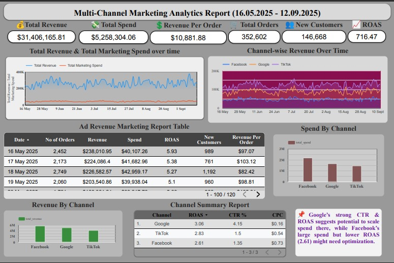

# Business Intelligence Dashboard - Lifesight

## Overview
This repository contains a high-level marketing intelligence dashboard designed to analyze performance across multiple digital channels and guide strategic decisions on budget allocation and campaign optimization. The dashboard helps identify which marketing channels deliver the best ROI and provides a foundation for more detailed future analyses.

## Dashboard Access
Live Dashboard Link: https://lookerstudio.google.com/reporting/81c69053-4a30-47de-bb2a-ce8397a8bd74

## Purpose
- Evaluate the performance of campaigns on TikTok, Google, and Facebook.
- Understand which channels to focus on for maximizing revenue and customer acquisition.
- Provide insights on key metrics such as impressions, clicks, spend, revenue, CTR, CPC, and ROAS.
- Enable data-driven decisions for scaling campaigns efficiently.

## Raw Data Sources
- **Business Data:** Sales, orders, new customers, revenue, and profit information.
- **TikTok Ads:** Campaign performance including impressions, clicks, spend, and attributed revenue.
- **Google Ads:** Campaign performance including impressions, clicks, spend, and attributed revenue.
- **Facebook Ads:** Campaign performance including impressions, clicks, spend, and attributed revenue.

## Key Metrics / KPIs
- **Total Revenue:** Total sales revenue generated.
- **Gross Profit:** Revenue minus cost of goods sold.
- **COGS:** Cost of producing the goods sold.
- **Impressions & Clicks:** User engagement with ad campaigns.
- **Attributed Revenue:** Revenue attributed to specific ad campaigns.
- **CTR (Click-Through Rate):** Effectiveness of ads in generating clicks.
- **CPC (Cost per Click):** Cost efficiency of ad campaigns.
- **ROAS (Return on Ad Spend):** Revenue generated per unit of ad spend.

## Technology Stack
- **Data Cleaning & Preparation:** Python / Google Colab
- **Dashboard & Visualization:** Looker Studio (Google Data Studio)
- **Version Control:** Git & GitHub

## Objective
To enable the business to:
- Understand the effectiveness of different marketing channels.
- Optimize ad spend for maximum ROI.
- Track daily, weekly, and monthly performance metrics.
- Make informed decisions based on data-driven insights.

## Future Improvements
- Incorporate program-level analysis for each marketing channel.
- Include geographical and demographic performance insights.
- Integrate additional KPIs and predictive analytics to forecast campaign ROI.
- Enhance the dashboard with more granular reporting for better optimization.

## Usage
1. Import sales and ad data into the dashboard.
2. Visualize KPIs and compare campaign performance across platforms.
3. Use insights to adjust marketing strategies and budget allocation.

## Author
Ankit Pallav | ankitpallav2602@gmail.com
